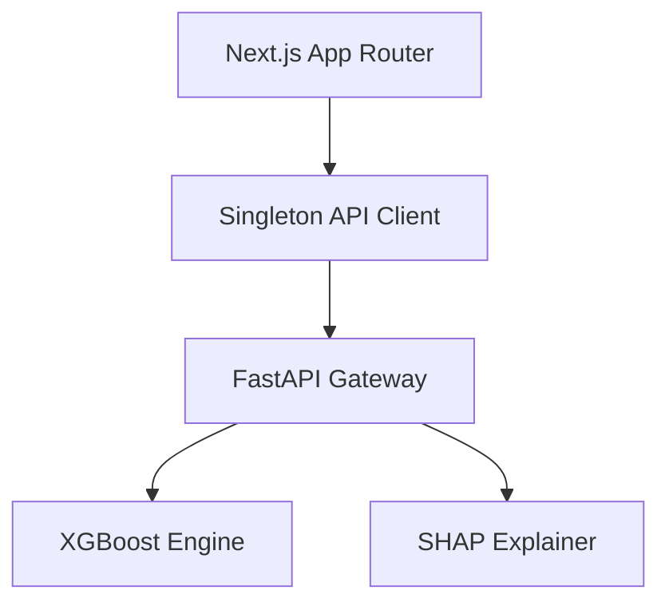

# 🧠 RetainFlow: Neural Intelligence for Customer Retention

RetainFlow is a mission-critical **Next.js 14+** enterprise interface designed to bridge the gap between complex machine learning models and actionable business operations. It provides a real-time, low-latency bridge to the **FastAPI Intelligence Layer**.

## 🏗️ Core Architectural Pillars

### 1. The Inference Orchestrator (`/predict`)

A reactive engine designed for high-precision customer lifecycle mapping.

* **Contextual Validation:** Prevents "garbage-in/garbage-out" via strict TypeScript interfaces and Zod schema validation.
* **Probability Mapping:** Translates raw model logits into human-readable risk quartiles.
* **Strategic Playbooks:** Dynamically generates retention "tactics" based on the specific churn drivers (e.g., suggesting "Fiber Optic" upgrades if high latency is detected).

### 2. High-Throughput Batch Pipeline

Engineered for quarterly audits and bulk retention campaigns.

* **Streamed Processing:** Handles multi-row CSV ingestion without blocking the main UI thread.
* **Data Parity Check:** Automatically maps CSV headers to the ML model's expected feature set.

### 3. Model Transparency Suite (Explainable AI)

A dedicated environment for Data Scientists and Product Managers to audit model health.

* **Feature Weights:** Real-time visualization of global feature importance.
* **Health Telemetry:** Live monitoring of the FastAPI microservice with automatic failover UI states.

---

## 🛠️ Technical Implementation

### The Dependency Graph

The system is built on a **Modular Singleton** pattern to ensure API consistency.



### 💉 Service Layer Blueprint (`lib/client.ts`)

We utilize a robust class-based wrapper for standardized error propagation:

```typescript
export class RetentionService {
  private static instance: RetentionService;
  
  // Implements circuit-breaker patterns for API calls
  async executeInference(payload: CustomerPayload): Promise<InferenceResponse> {
    const response = await fetch(`${process.env.NEXT_PUBLIC_API_URL}/predict`, {
      method: 'POST',
      headers: { 'Content-Type': 'application/json' },
      body: JSON.stringify(payload),
    });
    
    if (!response.ok) throw new InferenceError(response.statusText);
    return response.json();
  }
}

```

---

## 🎨 Design System & UX Philosophy

We employ a **Glassmorphic** design language using **Tailwind CSS** and **Shadcn/UI** to maintain professional aesthetic density.

| Component | UX Logic |
| --- | --- |
| **Risk Gauge** | Uses a color-interpolation scale (Green  Red) based on . |
| **Feature Impact** | Interactive bar charts that allow drilling into specific customer segments. |
| **Status Sentinel** | A global state listener that pings the backend every 30s to verify model availability. |

---

## 🚀 Deployment Orchestration

### Environment Variables

| Key | Context | Expected Value |
| --- | --- | --- |
| `NEXT_PUBLIC_MODEL_ENV` | Runtime Logic | `production` |
| `NEXT_PUBLIC_API_URL` | Backend Endpoint | `https://api.retainflow.io` |

### Rapid Start

1. **Initialize State:** `pnpm install`
2. **Sync Intelligence Layer:** Ensure the FastAPI `uvicorn` worker is hot-reloading.
3. **Boot Interface:** `pnpm dev`

---

## 📡 Diagnostic Protocol

* **Network Latency:** If inference takes , verify the FastAPI worker's `max_workers` configuration.
* **Schema Drift:** If the model is retrained with new features, the `CustomerPayload` interface in `types/index.ts` must be updated to maintain type-safety.
* **CORS Policy:** Ensure the backend whitelist includes the production Vercel/Docker domain.

**Would you like me to create the corresponding `types/index.ts` file to ensure your frontend data perfectly matches the backend schema?**